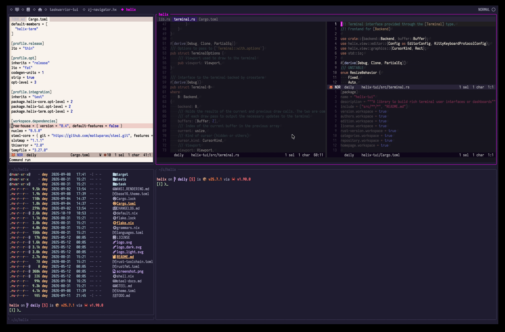

# zj-navigator

Navigate seamlessly between Helix splits and Zellij panes with `Alt-h`, `Alt-j`, `Alt-k`, and `Alt-l`.



## Installation

Clone the repo and

```
forge install
```

Add to `init.scm`

```scheme
(require "zj-navigator/zj-navigator.scm")
```

Build the accompanying Zellij plugin:

```
cd hx-navigator
cargo build --release
```

Modify `~/.config/zellij/config.kdl`. Change `/path/to/` as appropriate.

Add plugin to config.

```kdl
load_plugins {
    "file:/path/to/zj-navigator.hx/hx-navigator/target/wasm32-wasip1/release/hx-navigator.wasm"
}
```

Add bindings to the `shared_except "locked"` block.

```kdl
shared_except "locked" {
    bind "Alt h" {
        MessagePlugin "file:/path/to/zj-navigator.hx/hx-navigator/target/wasm32-wasip1/release/hx-navigator.wasm" {
            name "focus_left";
        }
    }
    bind "Alt j" {
        MessagePlugin "file:/path/to/zj-navigator.hx/hx-navigator/target/wasm32-wasip1/release/hx-navigator.wasm" {
            name "focus_down";
        }
    }
    bind "Alt k" {
        MessagePlugin "file:/path/to/zj-navigator.hx/hx-navigator/target/wasm32-wasip1/release/hx-navigator.wasm" {
            name "focus_up";
        }
    }
    bind "Alt l" {
        MessagePlugin "file:/path/to/zj-navigator.hx/hx-navigator/target/wasm32-wasip1/release/hx-navigator.wasm" {
            name "focus_right";
        }
    }
}
```

Approve the plugin permissions when Zellij asks. It forwards the keys to Helix when the focused pane is running `hx`; otherwise it moves Zellij focus. The hx plugin moves the view and falls back to zellij action for moving focus if view doesn't change.

## Working with External Programs

It's common to launch yazi/lazygit via piping in via STDIN:

```
e = [
":sh rm -f /tmp/unique-file",
":insert-output env -u persistent -u ZELLIJ yazi %{buffer_name} --chooser-file=/tmp/unique-file",
':insert-output echo "\x1b[?1049h\x1b[?2004h" > /dev/tty',
":open %sh{cat /tmp/unique-file}",
":redraw",
]
```

```
g = [
":write-all",
":new",
":insert-output lazygit -ucf \"$HOME/.config/lazygit/config.yml\"",
":buffer-close!",
":redraw",
":reload-all",
]
```

For zellij movement while in this external_tui add the following hooks at beginning/end.

```
key = [
":sh zellij pipe --name external_tui_enter -- %sh{echo $ZELLIJ_PANE_ID}",
...
":sh zellij pipe --name external_tui_exit -- %sh{echo $ZELLIJ_PANE_ID}",
]
```
